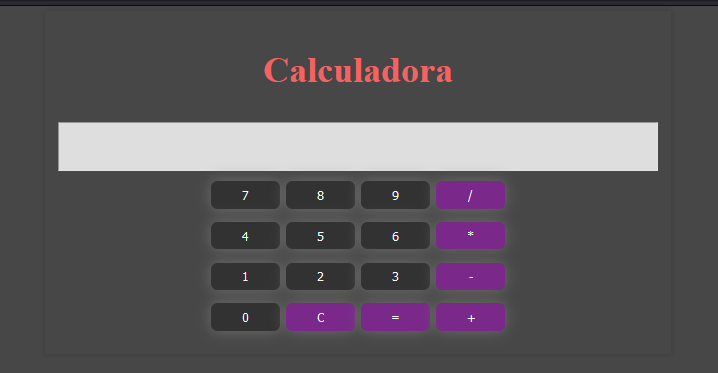

# 

## Calculadora Simple

Esta es una calculadora simple construida con HTML y CSS, utilizando Flexbox y Grid para el diseño. No se ha utilizado JavaScript en este proyecto.

## Estructura del Proyecto

- `index.html`: Contiene la estructura HTML de la calculadora.
- `styles.css`: Contiene los estilos CSS para la calculadora.

## Propiedades CSS Utilizadas

- **Flexbox**: Se utilizó para centrar la calculadora en la página.
  - `display: flex;`
  - `justify-content: center;`
  - `align-items: center;`

- **Grid**: Se utilizó para organizar los botones de la calculadora en una cuadrícula.
  - `display: grid;`
  - `grid-template-columns: repeat(4, 1fr);`
  - `gap: 10px;`

- **Estilos Generales**: 
  - Se añadieron estilos para el fondo, bordes, colores y efectos de hover en los botones.

## Captura de Pantalla

## Uso

Puedes abrir el archivo `index.html` en tu navegador para ver la calculadora en acción. Aunque no tiene funcionalidad, la estructura está lista para ser ampliada con JavaScript si se desea.
<!-- 
Crear una calculadora

Usando Flex o Grid (puede ser ambos), crear una pagina de una calculadora. El diseño de su calculadora es libre puede ser minimalista o moderna eso dependerá de tu creatividad, además no se debe usar JavaScript (js).
 
Para tener un orden, tu proyecto deberá estar en un nuevo repositorio. Además de crear un readme explicando el uso de las propiedades que has utilizado en tu pagina web, como adicional a esto en el propio readme adjuntar captura de pantalla de la pagina.
 -->